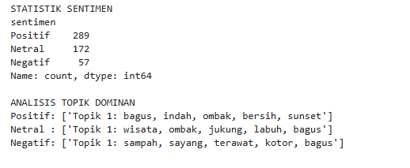
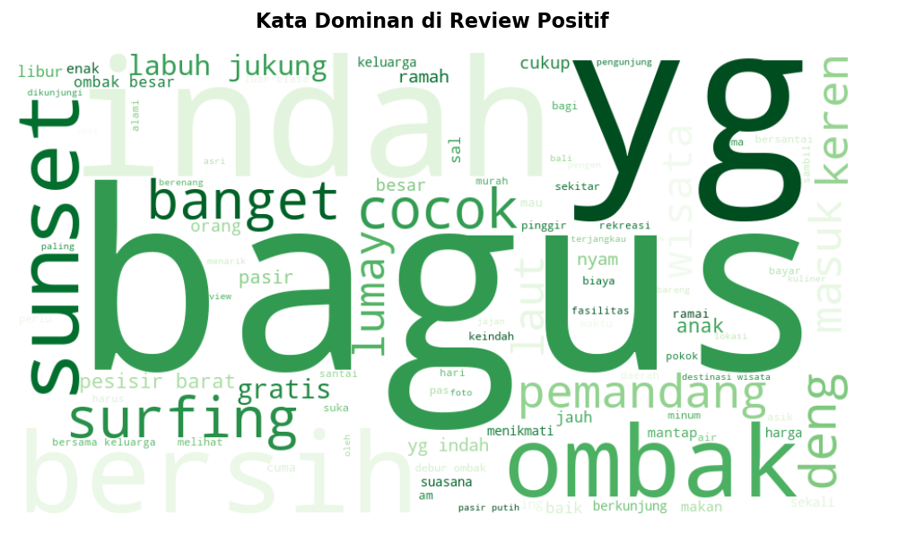
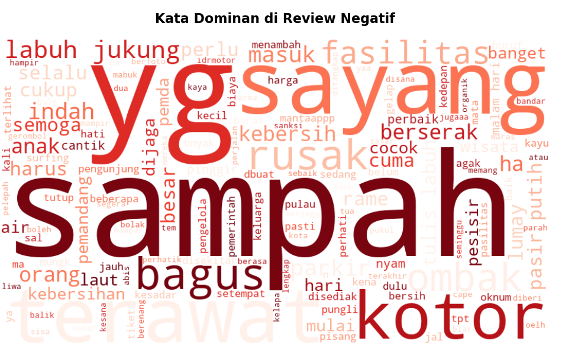
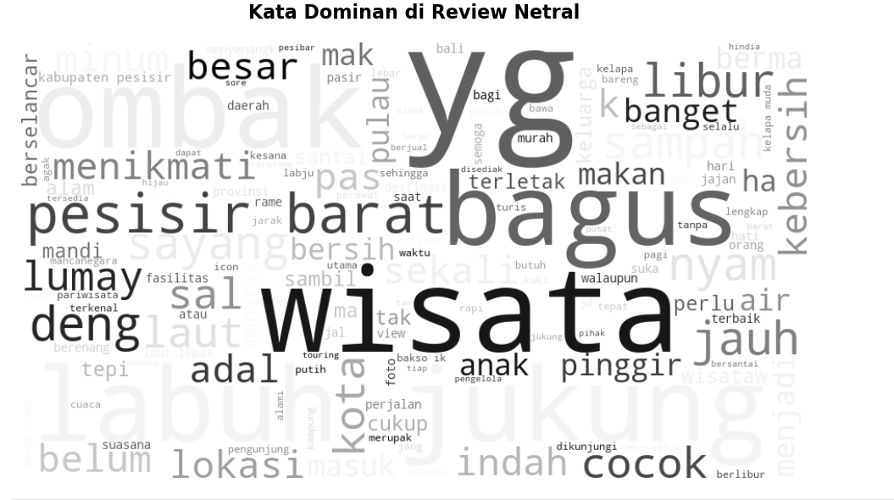

<h1>Isi Repository</h1>
Repository ini bertujuan untuk menganalisis sentimen pengunjung terhadap Pantai Labuhan Jukung, Lampung, berdasarkan ulasan yang diambil dari Google Maps. Dengan pendekatan klasifikasi Rule-Based (lexicon-based (kamus kata)), ulasan diklasifikasikan menjadi sentimen Positif, Netral, atau Negatif untuk memahami aspek apa yang paling disukai atau dikeluhkan oleh wisatawan terhadap Pantai Labuhan Jukung, Lampung.

 
 
<h1>Alur Kerja Repository</h1>
1. Data Scraping: Pengambilan data ulasan secara real-time menggunakan teknik web scraping. 
2. Pre-processing: Pembersihan data teks meliputi: Case Folding, Filtering, Stopwords Removal. 
3. Penetapan Rule: Penyusunan kamus kata (lexicon) positif dan negatif. 
4. Klasifikasi Data: Pemberian label sentimen berdasarkan skor bobot kata yang muncul. 
5. Visualisasi: Untuk memudahkan proses pengambilan insight data. 

 
 
<h1>Hasil Visualisasi</h1>
Berdasarkan hasil analisis sentimen yang telah dilakukan pada dataset Pantai Labuhan Jukung, Lampung. Berikut adalah gambaran kata-kata yang paling sering muncul dalam ulasan pengunjung yang direpresentasikan melalui WordCloud:
 
 

 

  
  
<i>Gambar: Statistik Sentimen dan Analisis Topik Dominan Pantai Labuhan Jukung</i>

 

  
  
<i>Gambar: Wordcloud Positif Pantai Labuhan Jukung</i>

 

  
  
<i>Gambar: Wordcloud Negatif Pantai Labuhan Jukung</i>

 

  
  
<i>Gambar: Wordcloud NetralPantai Labuhan Jukung</i>

 
<h1>Insight</h1>
Sentimen Negatif Menunjukkan Perlu Dilakukan Pembenahan Pada Area Berikut:
 
Kebersihan: Kata "sampah" dan "kotor". Ini adalah keluhan nomor satu pengunjung Pantai Labuhan Jukung.
 
Fasilitas: Kata "fasilitas" dan "rusak" mengindikasikan adanya penurunan kualitas pada fasilitas yang diberikan kepada pengunjung.
 
Kekecewaan: Kata "sayang" menunjukkan ekspektasi pengunjung yang tidak terpenuhi karena faktor berbagai macam faktor, salah satunya Kebersihan.

 
Sentimen Positif Menunjukkan Faktor Yang Disukai Pengunjung Pantai Labuhan Jukung:
 
Keindahan Alam: Kata "indah", "sunset", "pemandang", dan "ombak" adalah nilai jual utama pantai ini.
 
Aktivitas Yang Bisa Dilakukan:  Kata "surfing" dan "labuh jukung", menunjukkan aktivitas surfing merupakan andalan dipantai ini.
 
Wisata Ramah Keluarga: Kata "keluarga", "ramah", dan "murah" mengungkapkan bahwa pantai ini adalah wisata yang ramah keluarga.
